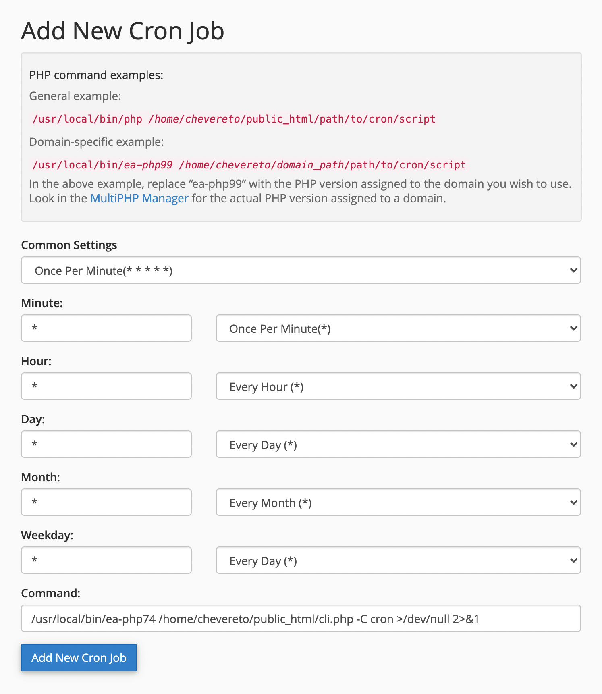

# ⏲️ cPanel CRON

## Add new CRON job

* Go to **Cron Jobs** under **Advanced**
* Scroll to **Add New Cron Job**



* Under **Common Settings** pick `Once Per Minute (* * * * *)`

The **Command** varies on each installation, you need to create your own command based on the following general form:

```sh
php-binary cli-path -C cron >/dev/null 2>&1
```

* **php-binary** Check the `PHP command examples` section under **Add New Cron Job** where you can learn about the PHP path for your system.
* **cli-path** The Chevereto CLI path can be found on your Dashboard panel under **Installation details**.

### Command examples

<code-group>
<code-block title="General">
```sh
/usr/local/bin/ea-php81 /home/chevereto/public_html/app/bin/legacy -C cron >/dev/null 2>&1
```
</code-block>

<code-block title="CloudLinux">
```sh
/opt/alt/php81/usr/bin/php /home/chevereto/public_html/app/bin/legacy -C cron >/dev/null 2>&1
```
</code-block>
</code-group>
