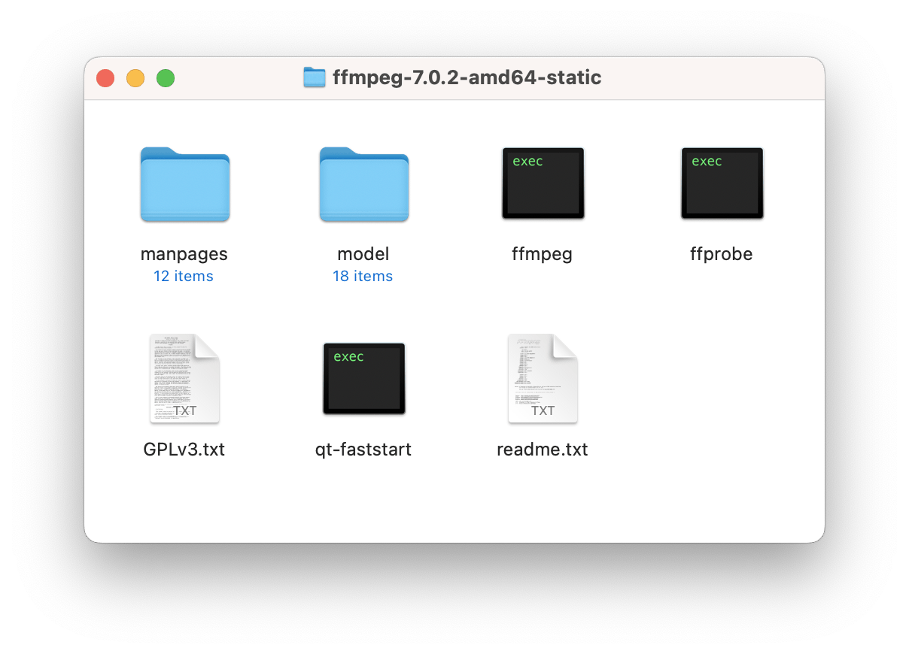

# cPanel FFmpeg

To get video uploads to work on cPanel you need to install FFmpeg and configure Chevereto to use it.

## Download FFmpeg

Download FFmpeg static build from the official website at [ffmpeg.org/download.html](https://ffmpeg.org/download.html). Double check that you are downloading the static build, and that it is compatible with your server's architecture.

You can check your cPanel server architecture under the "Server Information" section.

## Upload FFmpeg

The FFmpeg distribution comes in a compressed file, you need to extract it and upload the folder containing the binaries to your server.



You can upload these to any directory long as it is visible for your cPanel user. For example, you can use `/home/user/bin/` and ending up with:

```sh
/home/user/bin/ffmpeg-7.0.2-amd64-static
```

## Configure Chevereto

After installing Chevereto you can configure it to use custom FFmpeg binaries. You need to [configure](../../application/configuration/configuring.md#using-app-env-php) to use the following environment variables matching to the paths where you uploaded the binaries:

```php
<?php

return [
  // ...
  'CHEVERETO_BINARY_FFMPEG' => '/home/user/bin/ffmpeg-7.0.2-amd64-static/ffmpeg',
  'CHEVERETO_BINARY_FFPROBE' => '/home/user/bin/ffmpeg-7.0.2-amd64-static/ffprobe',
];
```

You can check if this worked by going to `/dashboard` where you will see the report on detected FFmpeg and FFPROBE.
