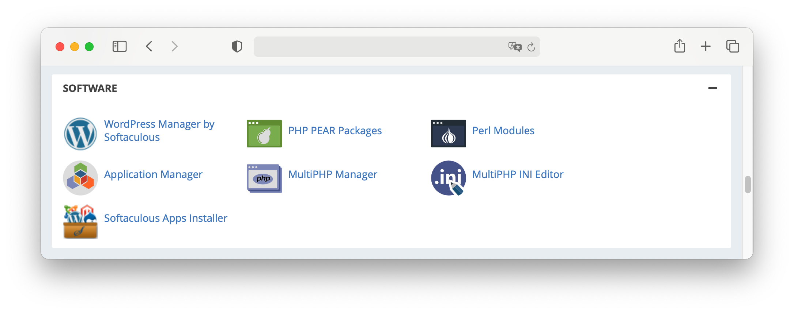
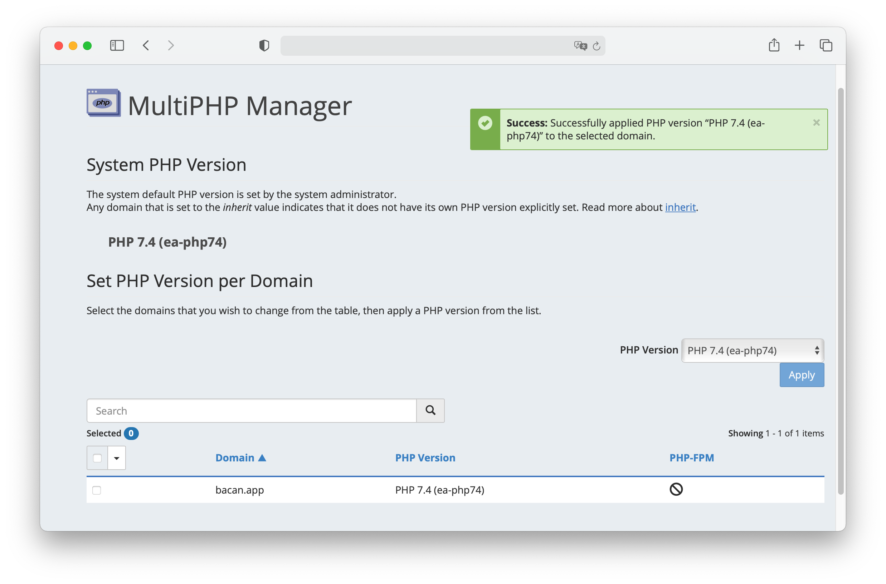

# cPanel PHP

## MultiPHP INI Editor

Go to **MultiPHP INI Editor** under **Software**.



Select your website under **Configure PHP INI basic settings**.


Take note on the following configurable keys:


* `max_execution_time` 30
* `memory_limit` 256M (min)
* Use `post_max_size` and `upload_max_filesize` to limit the file upload max. size allowed for uploads

## MultiPHP Manager

Go to **MultiPHP Manager** and select `PHP 8.1` for your website.



* From here you can also enable the [PHP extensions required](../../application/stack/php.md#extensions) by Chevereto.

::: danger PHP Extensions
Refer to the cPanel [PHP Extensions and Applications Package](https://docs.cpanel.net/whm/software/php-extensions-and-applications-package/) and WHM [How to install a PHP extension in WHM](https://support.cpanel.net/hc/en-us/articles/360050971633) documentation if your cPanel provisioning lacks the extensions required by Chevereto.
:::

## PHP Versioning

::: tip Did you know?
cPanel uses root `.htaccess` file to add rules that enable to override the default cPanel PHP versioning. This may cause issues in your Chevereto installation.
:::

If you have PHP versioning issues make sure that the root `.htaccess` file contains the following:

<code-group>
<code-block title="Apache">
```apacheconf
<IfModule mime_module>
  AddHandler application/x-httpd-ea-php81 .php
</IfModule>
```
</code-block>

<code-block title="LiteSpeed">
```apacheconf
<IfModule mime_module>
  AddHandler application/x-httpd-ea-php81___lsphp .php
</IfModule>
```
</code-block>
</code-group>

Note that the configuration in your system may vary. Double-check with your service provider.

## Troubleshooting

As cPanel uses `.htaccess` to configure PHP version, it needs a special handling when you want to change the PHP version of your website.

1. Upload Chevereto's `.htaccess`
2. Go to Multi-PHP and select the new PHP version
