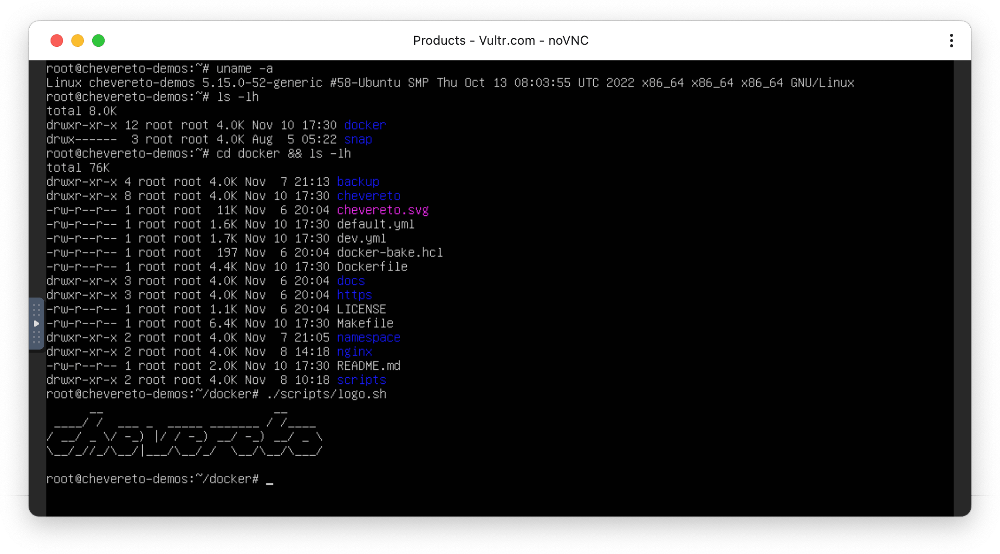

# 🐋 Docker

::: tip
This is the **best way** to deploy Chevereto.
:::

Docker refers to container technology, in this context you don't need to worry about PHP versioning, missing extensions, virtual host configuration, database server, anything. This is the best way to deploy Chevereto as the software infrastructure is provided by us.

This deploy alternative provides:

* Support for multiple instances
* Portability
* Easy maintenance
* Automatic HTTPS setup
* Customization

## Repository

Check the repository at [chevereto/docker](https://github.com/chevereto/docker) for instructions.

## Requirements

* Chevereto license
  * [Purchase](https://chevereto.com/pricing) new license
  * [Access](https://chevereto.com/panel/license) existing purchase
* Server with
  * Terminal access ([Linode](https://chv.to/linode), [Vultr](https://chv.to/vultr), etc.)
  * `make`, `unzip`, `curl` and `git`
* Hostname pointing to server

## Getting a server

For this guide we are referring to a server as a machine where you can [install Docker](https://docs.docker.com/engine/install/). In this server you will install Chevereto and expose it to the internet.

For this guide we will use Ubuntu.

You can use any computer, even at your home or from any cloud provider. You may check a server from our partners ([Linode](https://chv.to/linode), [Vultr](https://chv.to/vultr)) including free credits.

## Server terminal

This refers to access your server via terminal software. Don't feel intimidated, is not that hard as your cloud provider may supply a web-based terminal software which is good enough for our purpose.



We recommend using SSH protocol with terminal software installed in your computer.


💡 Check that your server provides `make`, `unzip`, `curl` and `git`. You will require to install these utilities if missing.

```sh
which make unzip curl git
```

## Installing Docker

To install Docker follow the instructions [Docker Engine installation](https://docs.docker.com/engine/install/) for your server. For this guide we are using Ubuntu, we follow the specific instructions for it.


Read and follow the instructions to get Docker engine installed in your server.

## Cloning chevereto/docker

Get a copy of our base Docker project by cloning the repository in the server using `git`. This will create a `docker` folder in the current working directory.

```sh
git clone https://github.com/chevereto/docker.git
```

Go to this newly created `docker` folder.

```sh
cd docker
```

While on `docker` folder you can work with our Docker base project.

## Setup Cron

This process creates a Cron file at `/etc/cron.d/chevereto` that will run background jobs for all Chevereto instances in the server.

```sh
make cron
```

## Create proxy

This process creates the proxy service that handles incoming web traffic to the server. It will also provide automatic secure certificate for HTTPS.

```sh
make proxy EMAIL_HTTPS=mail@yourdomain.tld
```

At `EMAIL_HTTPS` option pass an email required for HTTPS certificate notifications.

## Build system image

This process builds the container image for the Chevereto application.

```sh
make image
```

## Setup namespace

A [namespace](https://github.com/chevereto/docker/blob/4.0/docs/NAMESPACE.md) is a file containing instance scoped variables. Create a namespace for each one of the Chevereto instances you want to deploy.

To create a namespace:

```sh
make namespace NAMESPACE=example and HOSTNAME=img.chevereto.dev
```

## Create Chevereto instance

```sh
make up-d NAMESPACE=example
```

👉 To create more instances repeat the steps from [Setup namespace](#setup-namespace) for each additional website you want to spawn.
