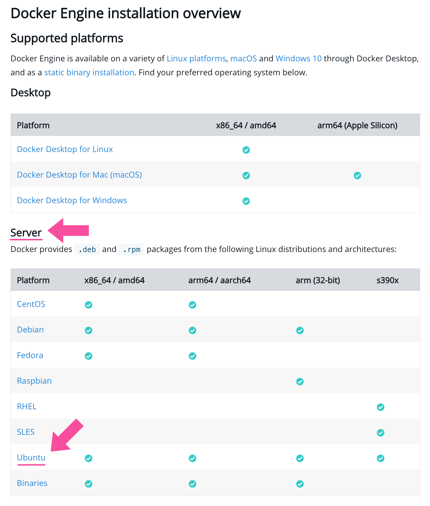

# 🐋 Docker

::: tip
This is the **best way** to deploy Chevereto. You can use [PURE DOCKER](#pure-docker) or our all-included project tooling.
:::

Docker refers to container technology. In this context you don't need to worry about the system infrastructure. This is the best way to deploy Chevereto as both the application and its infrastructure is provided by us.

## Advantages

* 🤹 Run multiple websites in the same machine
* 📱 Portability
* 🚀 Easy to update
* 👮‍♂️ More secure
* 🔐 Automatic HTTPS setup
* 🌎 CloudFlare integration

## Repository

Check the repository at [chevereto/docker](https://github.com/chevereto/docker) for all instructions and source code.

## Requirements

* Chevereto license (for paid edition)
  * [Purchase](https://chevereto.com/pricing) new license
  * [Access](https://chevereto.com/panel/license) existing purchase
* Unix-like server with shell access
* Hostname pointing to server
  * `mywebsite.com` pointing to `sever IP`

See [CloudFlare](https://github.com/chevereto/docker/blob/4.0/docs/CLOUDFLARE.md) for instructions on how to setup automatic DNS integration

## Pure Docker

Our base image is available at:

```sh
ghcr.io/chevereto/chevereto:latest
```

You can get this container running with the following command:

```sh
docker run -d \
  --name chevereto \
  -p 80:80 \
  -e CHEVERETO_DB_HOST=database \
  -e CHEVERETO_DB_USER=chevereto \
  -e CHEVERETO_DB_PASS=user_database_password \
  -e CHEVERETO_DB_PORT=3306 \
  -e CHEVERETO_DB_NAME=chevereto \
  -e CHEVERETO_ASSET_STORAGE_TYPE=local \
  -e CHEVERETO_ASSET_STORAGE_URL=/images/_assets/ \
  -e CHEVERETO_ASSET_STORAGE_BUCKET=/var/www/html/images/_assets/ \
  -v /var/www/html/images/ \
  ghcr.io/chevereto/chevereto:latest
```

> Refer to [PURE-DOCKER](https://github.com/chevereto/docker/blob/4.0/docs/PURE-DOCKER.md) for a complete pure Docker command reference. Also check our [default.yml](https://github.com/chevereto/docker/blob/4.0/default.yml) compose file.

👉 If you have a Pro license you will require to [build](#build) the system image.

## Getting a server

For this guide you will require a machine where you can [install Docker](https://docs.docker.com/engine/install/) as in this machine (referred as server host) you will install Chevereto and expose it to the internet.

For this guide we will use an Ubuntu server.

> You can purchase a server from our partners ([Linode](https://chv.to/linode), [Vultr](https://chv.to/vultr)) including free credits.

## Shell access

The shell is a command-line interface that interprets user commands on the server. To access to the server shell you need terminal emulator software.

Here are some commonly-used terminal emulators by operating system:

| System  | Software                     |
| ------- | ---------------------------- |
| macOS   | Terminal, iTerm 2            |
| Windows | Windows Terminal, Putty      |
| Linux   | Gnome Terminal, Tilix, XTerm |

Once you get shell access check that your server has `make`, `unzip`, `curl` and `git` installed.

```sh
sudo apt install make unzip curl git
```

## Cloning chevereto/docker

We will use `git` to get a copy of our base Docker project. By running the following command a `docker` folder will be created in the current working directory.

```sh
git clone https://github.com/chevereto/docker.git
```

Go to this newly created `docker` folder.

```sh
cd docker
```

While on `docker` folder you can work with our Docker base project.

## Installing Docker

If you are using **Ubuntu** you can install Docker by running:

```sh
make install-docker
```

For other systems follow the instructions for [Docker Engine installation](https://docs.docker.com/engine/install/). Check at **Server** for your specific Linux distribution.

::: details Docker Engine installation

:::

## Setup Cron

This process creates a Cron that will run background jobs for your Chevereto websites.

```sh
make cron
```

## Create HTTPS proxy

We include an NGIX web server that will forward access to all your Chevereto websites and provide auto renewable HTTPS certificates.

To setup our proxy server run the following command:

```sh
make proxy EMAIL_HTTPS=mail@yourdomain.tld
```

At `EMAIL_HTTPS` option pass your email. It is required for HTTPS certificate notifications.

## Build Chevereto image

This process builds the container image for the Chevereto application.

💡 Omit this step when using free edition as the image is available at [GHCR](https://github.com/chevereto/chevereto/pkgs/container/chevereto).

```sh
make image
```

The process will ask for your license key.

> If no license is provided or you enter an invalid license the system will build the free image.

## Setup namespace

Create a [namespace](https://github.com/chevereto/docker/blob/4.0/docs/NAMESPACE.md) for each one of the Chevereto websites you want to deploy.

To create the `example` namespace for `img.chevereto.dev` hostname:

```sh
make namespace NAMESPACE=example HOSTNAME=img.chevereto.dev
```

## Spawn Chevereto website

To create a new website run `make spawn` command by passing the NAMESPACE option.

💡 When using free edition pass `EDITION=free`.

```sh
make spawn NAMESPACE=example
```

🎉 Congratulations! Chevereto is now up an running.

To create **more websites** repeat the steps from [Setup namespace](#setup-namespace) for each additional website you want to spawn.

## Updates

Refer to [UPDATING](https://github.com/chevereto/docker/blob/4.0/docs/UPDATING.md) for instructions on how to update Chevereto when using Docker.
